## Uncertain Knowledge Graph (UKG) generation pipeline

### Summary
This project is repository containing the Uncertain Knowledge Graph (UKG) generation pipeline. The main purpose of this pipeline is to convert scientific and scholarly articles in PDF format into an uncertain knowledge graph. This means that it extracts useful information from the text in the articles and generates triples, in the *(subject, predicate, object)* format.

For example with this sentence:
> ...adults with diabetes and low physical and mental activity (physical activity, social network, 
> work complexity, and education) showed a higher risk of dementia compared with those who were 
> diabetes free and engaged in moderate to high levels of such activity. [^1]

[^1]: Natan Feter, Danilo de Paula, Rodrigo Citton P. dos Reis, David Raichlen, Ana Luísa Patrão, Sandhi Maria Barreto, Claudia Kimie Suemoto, Bruce B. Duncan, Maria Inês Schmidt; Leisure-Time Physical Activity May Attenuate the Impact of Diabetes on Cognitive Decline in Middle-Aged and Older Adults: Findings From the ELSA-Brasil Study. Diabetes Care 23 February 2024; 47 (3): 427–434. https://doi.org/10.2337/dc23-1524

The triple generated:
*(diabetes, risk_factor_for, dementia, 1.00)*

You may notice that the triple is assigned a float *1.00*. This represents the confidence score of the triple (between 0.0 - 1.0). This means the pipeline has assigned the highest confidence score to this triple, indicating it has a certain probability of truth. A collection of these triples and confidence scores are used to construct an uncertain knowledge graph. 

---

### What does this repository contain?
1. A CLI tool written in Python (`ukg_generate.py`) which lets you convert a PDF scientific article into triples.
2. A full-stack web application which can do the following:
    - Upload PDF scientific articles  
    - Visualise the generated uncertain knowledge graph as interactive nodes and edges
    - Search the graph by querying entities (nodes) or relations (edges). Entities usually refer to the *subject* or *object* of a triple, and relations refer to the *predicate*
    - Filter the graph by PDF document and minimum confidence thresholds
    - View the list of triples within a graph
    - View the evidence (source document, section, and reference associated with the section) linked with the triple
    - (Advanced) Create your own entity and relation label lists
    - (Advanced) Upload your own ontologies and enable/disable them
    - (Advanced) Configure your own entity blacklists with *subject/object* matching rules


<details>
<summary>Screenshots</summary>

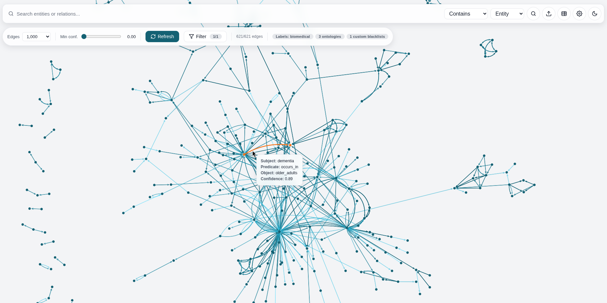
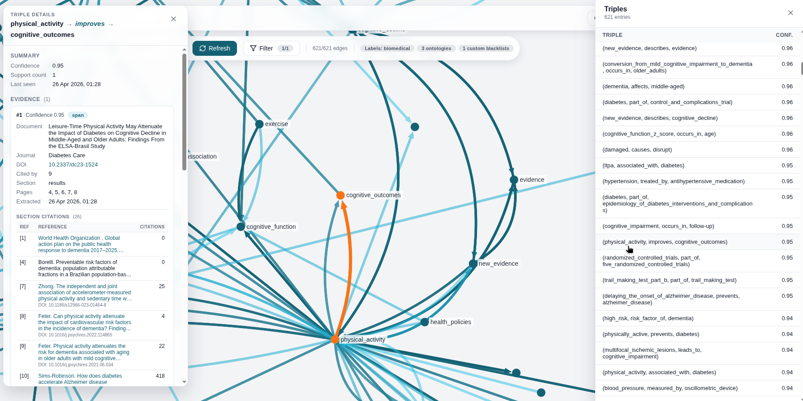
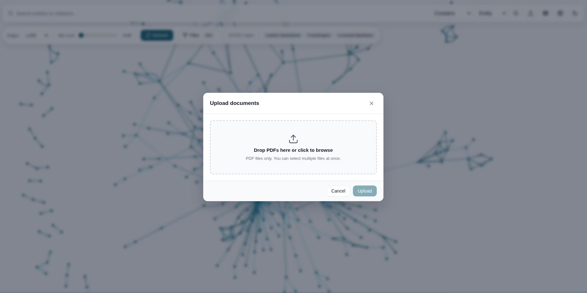
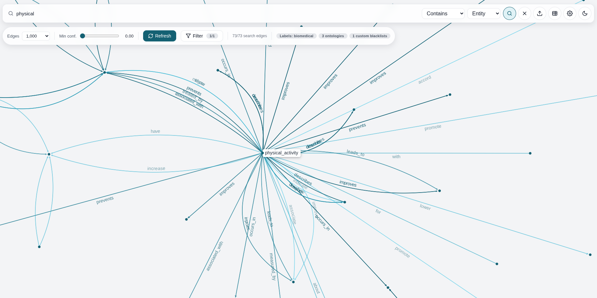
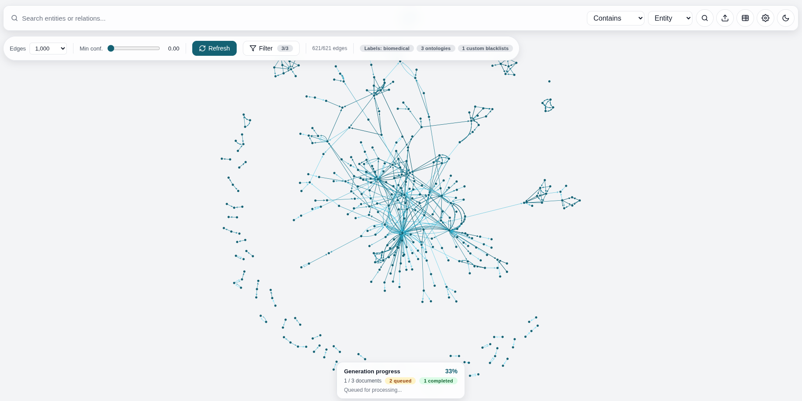
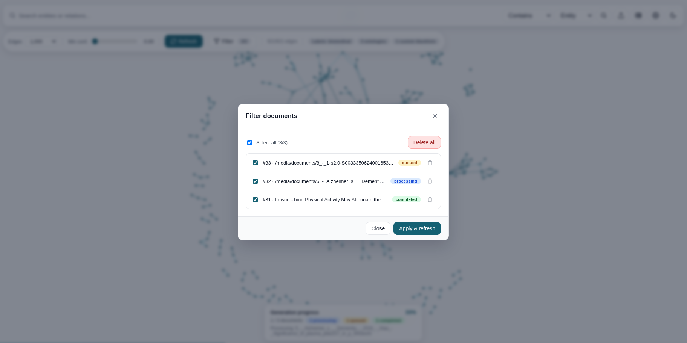
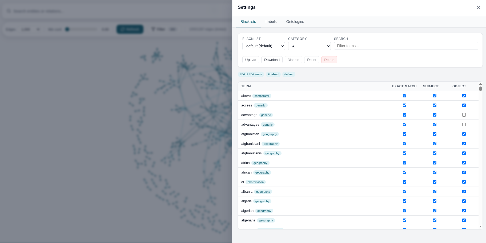
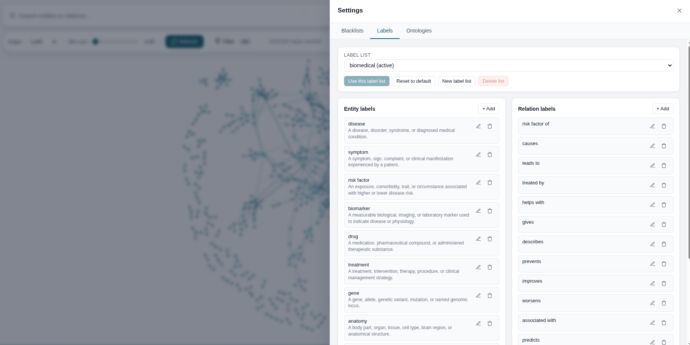
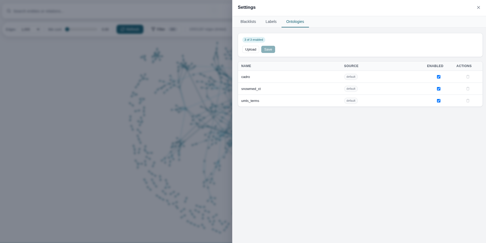
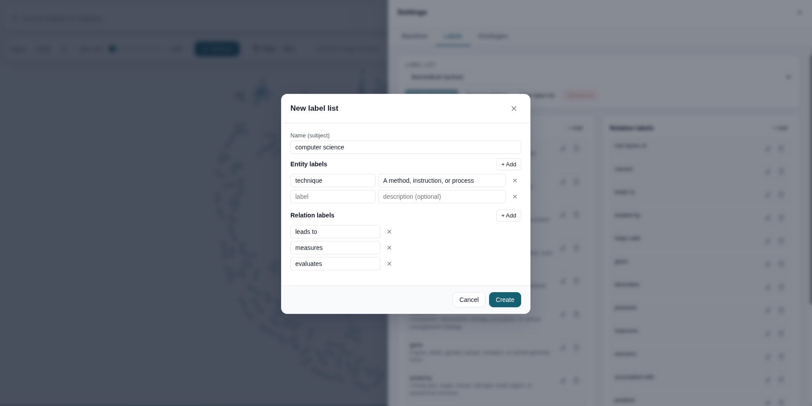
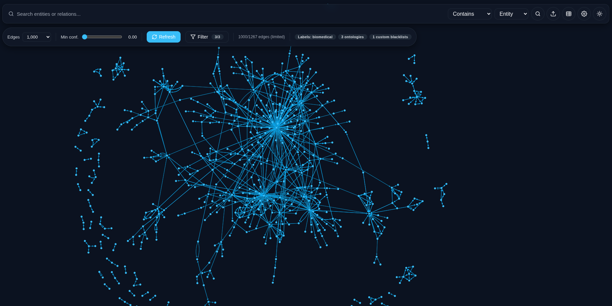
</details>

---

### Prerequisites

In order to run this application with smooth performance, a GPU is highly recommended.
Here are the minimum specs for running this application:
- CPU: 2.4GHz and above 
- RAM: 8 GB
- GPU: Nvidia GTX 1050Ti or equivalent

If you do not have a GPU, the pipeline will default to using your CPU. If you want to manually disable GPU usage even if your device has one, set the `UKG_DISABLE_GPU` environment variable to `1`:
```
export UKG_DISABLE_GPU 1
```

---

### Dependencies

This project requires [Python 3.13](https://www.python.org/downloads/release/python-31313/) and [Node.js (v24)](https://nodejs.org/en/download). Please visit the following links to download Python and Node.js for your operating system.

For managing this repository, [Git](https://git-scm.com/install/linux) and [Git LFS](https://git-lfs.com/) are required.

In order to run the CLI tool or the web application, you need to install all the Python dependencies used in this project.

To install dependencies run the following commands:

**Linux/Mac OS:**
```
python -m venv .venv                # Create a Python virtual environment
source .venv/bin/activate           # Activate the virtual environment
pip install -r requirements.txt     # Install Python dependencies
```
**Windows:**
```
python -m venv venv                 # Create a Python virtual environment
venv\Scripts\activate               # Activate the virtual environment
pip install -r requirements.txt     # Install Python dependencies
```

You will also need to install dependencies for Node.js to run the web application:

**Windows/MacOS/Linux**
```
cd frontend
npm install
```

---

### Using the CLI tool

Once you have activated your virtual environment and installed all Python dependencies, you can use the CLI tool to run the UKG generation pipeline on a PDF document.

Usage:
```
python src/ukg_generate.py <pdf_path> [options]
```

Here are the options you can use:
| Option                 | Description                                                                                                                                     |
|------------------------|-------------------------------------------------------------------------------------------------------------------------------------------------|
| -o, --output           | Path for the RDF output file (default: output/<name>/<name>.ttl)                                                                                |
| -f, --format           | RDF serialization format (default: turtle). You can specify: turtle, xml, n3, nt                                                                |
| -m, --model            | [spaCy model](https://spacy.io/usage/models) to use (default: en_core_web_lg)                                                                                                    |
| -n, --namespace        | Base RDF namespace URI (default: http://example.org/ukg#)                                                                                       |
| -l, --label-file       | Path to a JSON file containing entity and relation labels (default: resources/labels/biomedical_labels.json)                                    |
| -b, --blacklist        | Path to a CSV file containing blacklist terms or a directory containing blacklist CSV files (default: resources/blacklists)                     |
| -g, --ontology         | Path to an ontology .txt file or directory containing ontology .txt files (default: resources/ontologies)                                       |
| -r, --require-ontology | Drop triples that don't match any ontology term (default: False)                                                                                |
| --write-json           | Write the JSON file extracted from the PDF to disk                                                                                              |
| --read-json            | Read the JSON file extracted from the PDF from disk instead of a PDF file                                                                       |
| --write-tuples         | Write tuples.txt file from the extracted results and skip triple generation. This file contains all extracted section headers and section text. |
| --write-references     | Write references.txt file from the extracted results and skip triple generation. This file contains all references extracted from the document. |
| --no-span-extraction   | Disable GLiNER entity and relation extraction (use only natural language pattern matching)                                                      |
| --disable-enrichment   | Disable enrichment of extracted DOI metadata using an external provider (default: False)                                                        |
| --span-model           | [(GLiNER) Hugging Face model](https://huggingface.co/collections/knowledgator/gliner-relex) for span extraction (default: gliner-relex-large-v0.5)                                                                       |

By default, the CLI tool is configured to generate an uncertain knowledge graph adapted to the **biomedical domain**. You can change this to adapt to your prefered subject domain using your own labels, blacklists, and ontologies. 

⚠️ To configure **labels**, **blacklists** and **ontologies**, please see this section: [labels, blacklists, and ontologies](#settings-blacklists-labels-and-ontologies)


The main output of the CLI tool (when no other options are specified) is a turtle file containing the RDF serialized triples (\<name>.ttl) and a list of triples and their confidence scores (\<name>.txt).

<details>
<summary>Example file.ttl:</summary>

```
@prefix ukg: <http://example.org/ukg#> .

ukg:abnormalities ukg:occurs_in "cerebral_microvascular",
        "cerebral_microvascular_disease",
        "microvascular",
        "retinal",
        "retinal_microvascular" .

ukg:accumulation ukg:occurs_in "cells",
        "cells_lining_blood_vessels" .
```
</details>

<details>
<summary>Example file.txt</summary>

```
(being_physically_active, prevents, diabetes, 0.6166712820529938)
(being_physically_active, associated_with, diabetes, 0.46610020399093627)
(physically_active, prevents, diabetes, 0.6421783775091172)
(physically_active, associated_with, diabetes, 0.5556637704372407)
(cognitive_level, risk_factor_of, diabetes, 0.571578073501587)
(increased_risk, risk_factor_of, diabetes, 0.5819795936346055)
(increased_risk_of_cognitive_impairment, risk_factor_of, diabetes, 0.4795102208852768)
(physical_activity, associated_with, other_risk_factors, 0.44324577152729033)
(objectively_measured, measured_by, uk_biobank, 0.43920408487319945)
```
</details>

#### You can also specify if you want to extract only:

<details>
<summary>1. The JSON file (PyMUPDF format) from the PDF document, for example:</summary>

```
{
"filename": "/home/adamg/Documents/Repositories/ukg-generator/docs/test/paper.pdf",
"page_count": 15,
"toc": [],
"pages": [
{
"page_number": 1,
"width": 612.0,
"height": 792.0,
"boxes": [
    {
    "x0": 34.69609832763672,
    "y0": 28.79128074645996,
    "x1": 141.2604217529297,
    "y1": 52.3207893371582,
    "boxclass": "page-header",
    "image": null,
    "table": null,
    "textlines": [
    ...
```
</details>

<details>
<summary>2. The tuples.txt file (section headers + section text):</summary>

```
Introduction: Between 29% and 76% of patients with dementia may remain...
Introduction: Increasing age and the ε4 allele of the apolipoprotein E...
Introduction: The goal of this study was to create and validate a score...
Data source: We used a subset of cross-sectional data from the...
Data source: There were 7,869 participants in the training dataset...
Exposure assessment: Training dataset.Predictive factors consisted...
Exposure assessment: Validation dataset.Covariates measured included age...
Cognition assessment: Training dataset.Cognition was measured using a...
```
</details>

<details>
<summary>3. The references.txt file (references of the document):</summary>

```
1 | https://www.who.int/publications/i/item/global-action-plan-on-the-public-health-response-to-dementia-2017---2025 | World Health Organization . Global action plan on the public health response to dementia 2017–2025. Accessed 12 September 2023. Available from https://www.who.int/publications/i/item/global-action-plan-on-the-public-health-response-to-dementia-2017---2025
2 | https://doi.org/10.1016/S2468-2667(21)00249-8 | GBD 2019 Dementia Forecasting Collaborators. Estimation of the global prevalence of dementia in 2019 and forecasted prevalence in 2050: an analysis for the Global Burden of Disease Study 2019. Lancet Public Health, 7, p. e105, 2022. DOI: 10.1016/S2468-2667(21)00249-8
3 | https://doi.org/10.1016/S2214-109X(19)30074-9 | Mukadam. Population attributable fractions for risk factors for dementia in low-income and middle-income countries: an analysis using cross-sectional survey data. Lancet Glob Health, 7, p. e596, 2019. DOI: 10.1016/S2214-109X(19)30074-9
```
</details>

---

### Web application usage

Ensure that you have set up a Python virtual environment as shown in [Dependencies](#dependencies).

Then, you can either run and stop the webserver using the following scripts (Linux/Mac OS):
```
./start.sh      # Start the web application
./stop.sh       # Stop the web application
```

Or, you can follow the instructions below:

First, apply migrations to the server
```
cd backend
python manage.py migrate
```

Then run the backend server:
```
python manage.py runserver
```

In another shell, run:
```
cd frontend
npm run dev
```
You should be able to access the web application with this link: [http://localhost:5173](http://localhost:5173)

---
### Settings: Blacklists, Labels, and Ontologies

The settings for the CLI tool and web application are used to configure the same three options. Here are some details about each option and how to configure them.

#### Blacklists

Blacklists are used to filter out triples with specified rule matching. Blacklists are defined in their default form as CSV files with the following rows. Here is an example:
|term        |category       |rule     |subject|object|
|------------|---------------|---------|-------|------|
|analyses    |academic_syntax|excl_only|1      |1     |
|analysis    |academic_syntax|excl_only|1      |1     |
|approach    |academic_syntax|excl_only|1      |1     |
|area        |statistics     |excl_only|1      |1     |
|association |academic_syntax|excl     |1      |1     |
|associations|academic_syntax|excl_only|1      |1     |
|audio       |modal          |excl_only|1      |1     |

Here is what each row means:
- **term**: this is the term that you want to filter out (e.g. "population")
- **category**: this is a user-defined category for your term (e.g "geography")
- **rule**: this is either `excl` (filter out the triple if the term appears as a substring of the entity) or `excl_only` (filter out the triple if the term matches the entity exactly)
- **subject**: apply the filter rule to the subject of the triple (**subject**, predicate, object)
- **object**: apply the filter rule to the object of the triple (subject, predicate, **object**)

You can define your own blacklists with this exact CSV column format and pass them to the CLI tool with the `--blacklists` option or upload them to the web application in the `Settings > Blacklists` panel.

**Note:** The default blacklist cannot be disabled. It configured to provide optimal extraction results and it is not recommended to edit them unless necessary. You can always reset the default blacklists to its default values if needed.

#### Labels

Labels are lists of words that describe to the entity and relation extractor (the GLiNER-relex model) what entities and relations you would like to extract. Entity labels can also specify a description for each label to give more precise results.

Example (biomedical entity labels):
```
    "entity_labels": {
        "disease": "A disease, disorder, syndrome, or diagnosed medical condition.",
        "symptom": "A symptom, sign, complaint, or clinical manifestation experienced by a patient.",
        "risk factor": "An exposure, comorbidity, trait, or circumstance associated with higher or lower disease risk.",
        "biomarker": "A measurable biological, imaging, or laboratory marker used to indicate disease or physiology.",
        ...
    },

```

Example (biomedical relation labels):
```
    "relation_labels": [
        "risk factor of",
        "causes",
        "leads to",
        "treated by",
        "helps with",
        ...
    ]
```

These labels are defined in JSON files by default. You can define your own labels to use in the JSON format (have a look at [generic_labels.json](./resources/labels/generic_labels.json)). You can pass this JSON using `--label-file` option in the CLI tool.

On the web application you do not need to define a custom JSON, you can directly create new label lists (entity + relation labels) through the `Settings > Labels` panel.

#### Ontologies

These are `.txt` files of subject domain-specific terms which are used to boost the confidence score of a triple if one or more entities in the triple are found in the ontology.

For example (snomed_ct.txt):
```
...
Laryngeal edema
Laryngeal endocrine tumor
Laryngeal endocrine tumour
Laryngeal entrance
Laryngeal fistula prosthesis
Laryngeal fistula prosthesis (physical object)
Laryngeal foreign body
Laryngeal foreign body (disorder)
Laryngeal function studies
Laryngeal function studies (procedure)
Laryngeal gland
Laryngeal granuloma
...
```
You can also use your own ontologies (provided they are formatted in `.txt` with one term per line) adapted to your subject domain (of scientific articles). You can pass this to the CLI tool by using the `--ontology` option or upload them to the web application in the `Settings > Ontologies` panel.

### Default blacklists, labels, and ontologies

These are all located in the `resources` folder with this structure:
```resources
├── blacklists
│   ├── biomedical_blacklist.csv
│   └── default_blacklist.csv
├── labels
│   ├── biomedical_labels.json
│   └── generic_labels.json
└── ontologies
    ├── cadro.txt
    ├── snomed_ct.txt
    └── umls_terms.txt
```

This set of blacklists, labels, and ontologies are adapted specifically for the biomedical domain. However, if you intend on using the UKG generation pipeline or web application to extract knowledge from a different domain, you may want to see this section: [Adapting to different subject domain](#adapting-the-pipelineweb-application-to-extract-scientific-articles-of-a-different-domain)

---

### How does the pipeline work?

Below is a diagram of the UKG generation pipeline. The pipeline processes the document by performing the following tasks:

1. Extracts the PDF using PyMUPDF (and PyMUPDF4LLM) to generate a JSON with all text and metadata information.

2. Parse sections from the JSON data by applying chunking logic to identify headers and their associated paragraphs. At this stage, the metadata of the source document and its references (through DOI pattern identification) is retrieved using the Crossref API.

3. Link each section with their respective citations based on citation patterns found in the text

4. Process every sentence from each section using the spaCy NLP pipeline.

5. Identify four different natural language patterns (3 dependency based, 1 PoS based) in order to generate triples.

6. Use the GLiNER-relex model to extract entities and relations (with given entity and relation labels - defaults to labels adapted for biomedical text) in order to generate triples.

7. Deduplicate triples and filter out triples with invalid symbols, entities containing only stopwords, and using the blacklists given.

8. Score all triples according to their generation method and if the entity appears as an ontology term.

9. Either serialize and output triples (CLI tool) or pass the result data to knowledge graph construction service (web application)


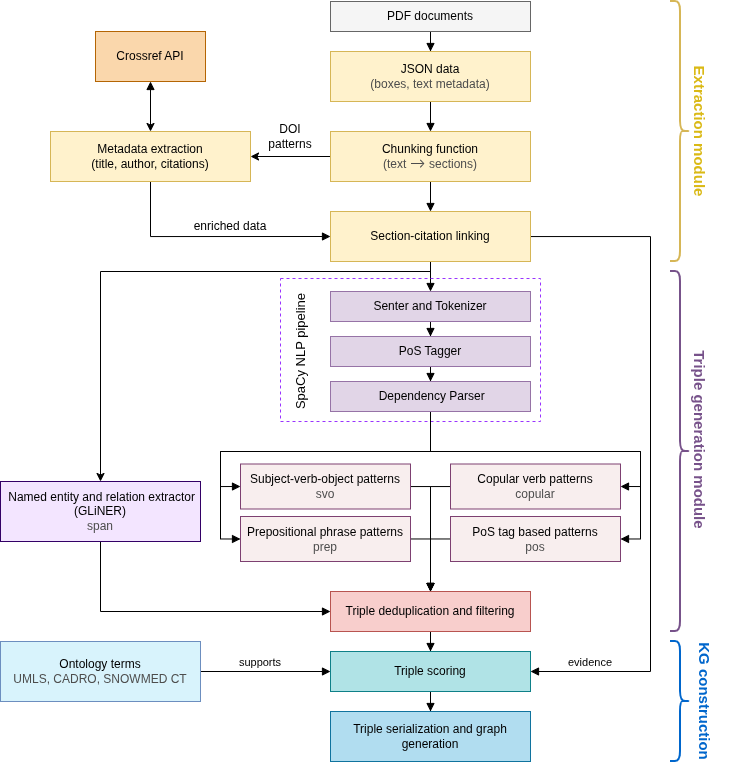

The web application runs using Vue.js and Django and requests are fed between the UKG generation pipeline, the Django backend server and the frontend according to this diagram:

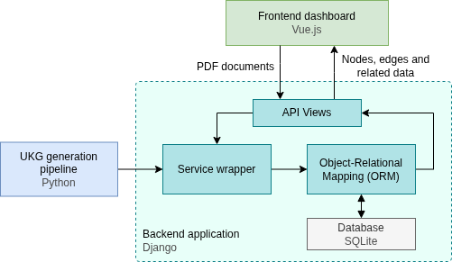

---

### Adapting the pipeline/web application to extract scientific articles of a different domain

As mentioned before, the default settings are adapted to extract scientific articles in the biomedical domain. However, the repository structure makes it easier to adapt to your own subject domain, but with varying levels of effort required depending on your needs. 

All of the domain-specific settings are not hard-coded into the pipeline, but passed in using [blacklists, labels, and ontologies](#settings-blacklists-labels-and-ontologies).

#### Recommended steps

Doing these is significantly easier on the website as it provides controls for enabling/disabling settings through clicking buttons. Here are the steps that you should do in order of increasing effort (you do not have to apply all of them):

1. **Disable the biomedical blacklist and existing ontologies**. Go to `Settings > Blacklists`, select `biomedical` in the dropdown, and click `Disable`. Then, go to `Settings > Ontologies` and uncheck `cadro`, `umls`, and `snomed_ct`. The default blacklist will always be applied, but you can choose to search and filter 

2. **Create your own entity/relation labels**. This is the most important first step because you can specify the types of entities and relations you want to extract. You can view the existing labels used by going to the `Settings > Labels` panel on the web application and selecting `biomedical`. The entity and relation extractor reliably returns the highest confidence triples. Once you've created your own label list, ensure you set it to active by clicking the `Use this label list` button after selecting it in the dropdown. 

3. **Upload your own custom ontology**. You may be able to find a plaintext list (or convert into one) an existing ontology for your subject domain online. Ensure that the file is in `.txt` format in order to use your ontology. Make sure that your ontology is checked in the `Settings > Ontologies` panel and click save.

4. **Define your own blacklist**. If there are triples being generated that contain noise or terms that are frequently appearing but does not consist of knowledge that you want to focus on, you can write your own blacklists ([format shown here](#blacklists)). You can use the [biomedical_blacklist.csv](./resources/blacklists/biomedical_blacklist.csv) as a template for writing your own blacklist. Ensure that your blacklist is enabled (it should show `Disable` on the button rather than `Enable` when you select your blacklist on the `Settings > Blacklists` panel).

---

### Disclaimer

This repository is part of a undergraduate dissertation project by Adam George at the University of Exeter.

Contact: ag990@exeter.ac.uk

