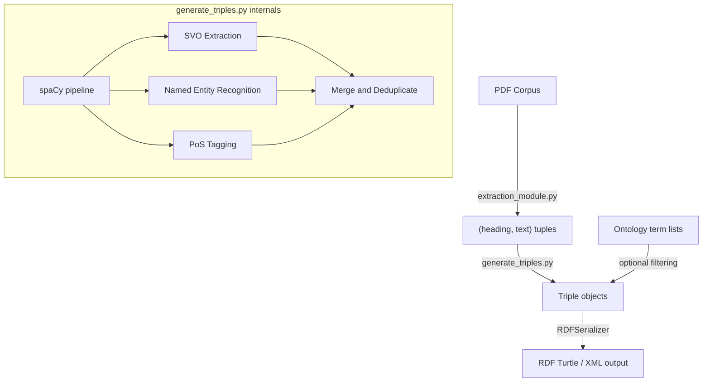

# Triple Generation Script Plan

## Context

The project already has:

- **PDF extraction** (`[src/extraction_module.py](src/extraction_module.py)`): converts PDFs to structured JSON, then post-processes into `(heading, text)` tuples
- **Dataset cleaning** (`[src/dataset_cleaning.py](src/dataset_cleaning.py)`): cleans UMLS/SNOMED/CADRO ontologies into term lists under `resources/ontology/`
- **Prototype triple extractor** (`[docs/extract_rdf_triples.py](docs/extract_rdf_triples.py)`): a working proof-of-concept `TripleExtractor` + `RDFSerializer` using spaCy dependency parsing
- **Stub** (`[src/generate_triples.py](src/generate_triples.py)`): currently only defines a `Triple` NamedTuple

The goal is to turn `src/generate_triples.py` into a production-ready module that the orchestrator (`src/ukg_generate.py`) can call.

---

## Architecture




---

## Step 1: Add dependencies

**File:** `[requirements.txt](requirements.txt)`

Add `spacy` and `rdflib` (currently missing):

```
spacy>=3.7,<4.0
rdflib>=7.0,<8.0
```

After install, download the spaCy model:

```bash
python -m spacy download en_core_web_sm
```

For higher accuracy on biomedical text, `en_core_web_trf` (transformer-based) or `scispacy` models can be swapped in later.

---

## \Step 2: Define data structures

**File:** `[src/generate_triples.py](src/generate_triples.py)`

Keep the existing `Triple` NamedTuple but extend it to carry provenance metadata:

```python
class Triple(NamedTuple):
    sub: str
    pred: str
    obj: str
    conf: float = 1.0
    source: str = ""       # extraction method: "svo", "ner", "pos", "prep", "copular"
    section: str = ""      # heading the triple was extracted from
```

---

## Step 3: Implement `TripleExtractor` class

**File:** `[src/generate_triples.py](src/generate_triples.py)`

Port and refine the logic from `[docs/extract_rdf_triples.py](docs/extract_rdf_triples.py)` into a class with these methods:

### 3a. `__init__(self, model_name="en_core_web_sm")`

- Load the spaCy model
- Reference: the existing init in `docs/extract_rdf_triples.py` lines 53-69

### 3b. `extract_svo(self, sent) -> list[Triple]`

- Walk the dependency tree from the ROOT verb
- Find `nsubj`/`nsubjpass` for subjects, `dobj`/`attr`/`oprd` for objects
- Build compound nouns via `_get_compound_noun()` (handles `compound`, `amod`, `nmod` deps)
- Build verb phrases via `_get_verb_phrase()` (handles `aux`, `prt` deps)
- Handle passive voice (`nsubjpass` + `agent` preposition)
- Tag each triple with `source="svo"`

**spaCy dependency labels reference:**

- `nsubj` — nominal subject
- `nsubjpass` — passive nominal subject
- `dobj` — direct object
- `attr` — attribute (complement of copular verb)
- `prep` / `pobj` — prepositional phrase
- `compound` — compound noun modifier
- `amod` — adjectival modifier

### 3c. `extract_copular(self, sent) -> list[Triple]`

- Match patterns where `token.lemma_` is in `("be", "become", "remain")` and `token.pos_ == "AUX"`
- Extract `nsubj` as subject, `attr`/`acomp` as object
- Use predicate `"is_a"` for these constructions
- Tag with `source="copular"`

### 3d. `extract_prep_relations(self, sent) -> list[Triple]`

- For tokens where `dep_ == "prep"` and the head is a noun (`NOUN`/`PROPN`), create triples: `(head_noun, preposition, pobj)`
- Tag with `source="prep"`

### 3e. `extract_entities(self, doc) -> list[Triple]`

- Use spaCy NER: iterate `doc.ents`, create `(entity_text, "is_a", entity_label)` triples
- Tag with `source="ner"`

### 3f. `extract_pos_triples(self, sent) -> list[Triple]` (new — PoS tagging)

- Use PoS tags to find additional noun-verb-noun patterns that the dependency parser might miss
- Walk tokens: when a `VERB` is found between two `NOUN`/`PROPN` tokens, create a candidate triple
- Filter by requiring the noun tokens to be within a reasonable window (e.g., 5 tokens)
- Assign lower confidence (e.g., `conf=0.5`) since this is a heuristic fallback
- Tag with `source="pos"`

**spaCy PoS tags reference:**

- `NOUN` — common noun
- `PROPN` — proper noun
- `VERB` — verb
- `AUX` — auxiliary verb
- `ADJ` — adjective
- `ADP` — adposition (preposition)

### 3g. `extract_from_text(self, text, section="") -> list[Triple]`

- Process text through the spaCy pipeline
- For each sentence, call `extract_svo`, `extract_copular`, `extract_prep_relations`, `extract_pos_triples`
- Call `extract_entities` on the full doc
- Deduplicate triples (by `(sub, pred, obj)` tuple)
- Attach `section` metadata
- Return combined list

---

## Step 4: Implement `RDFSerializer` class

**File:** `[src/generate_triples.py](src/generate_triples.py)`

Port from `[docs/extract_rdf_triples.py](docs/extract_rdf_triples.py)` lines 255-313:

- `__init__(self, base_namespace)` — create `rdflib.Graph`, bind namespace
- `add_triple(self, triple)` — convert subject/predicate to URIs, object to URI (if `is_a`) or Literal
- `serialize(self, format="turtle")` — return serialized string
- `save(self, filepath, format="turtle")` — write to file

---

## Step 5: Implement ontology-aware filtering (optional enhancement)

**File:** `[src/generate_triples.py](src/generate_triples.py)`

- Load term lists from `resources/ontology/` (UMLS, SNOMED, CADRO)
- After extraction, boost confidence of triples where subject or object matches a known ontology term
- Optionally filter out triples that contain no recognized domain terms

This ties the cleaned datasets from `[src/dataset_cleaning.py](src/dataset_cleaning.py)` into the extraction pipeline.

---

## Step 6: Add pipeline entry point

**File:** `[src/generate_triples.py](src/generate_triples.py)`

Add a `generate_triples()` function that orchestrates the full workflow:

```python
def generate_triples(
    tuples: list[tuple[str, str]],
    model_name: str = "en_core_web_sm",
    base_namespace: str = "http://example.org/ukg#",
    output_path: str | None = None,
    output_format: str = "turtle",
) -> list[Triple]:
```

- Accepts `(heading, text)` tuples from `extraction_module.post_process_json_data()`
- Instantiates `TripleExtractor`, processes each section
- Optionally serializes to RDF via `RDFSerializer`
- Returns the full triple list

---

## Step 7: Wire into the orchestrator

**File:** `[src/ukg_generate.py](src/ukg_generate.py)` (currently empty)

Create a minimal orchestrator that chains:

1. `extraction_module.extract_json_data(pdf_path)` — PDF to JSON
2. `extraction_module.post_process_json_data(json_path)` — JSON to `(heading, text)` tuples
3. `generate_triples.generate_triples(tuples)` — tuples to RDF triples

Accept a PDF path as CLI argument, output a `.ttl` file.

---

## Key spaCy Concepts Reference


| Concept               | API                        | Description                               |
| --------------------- | -------------------------- | ----------------------------------------- |
| Tokenization          | `doc = nlp(text)`          | Splits text into tokens                   |
| Sentence segmentation | `doc.sents`                | Iterates sentence `Span` objects          |
| PoS tagging           | `token.pos_`, `token.tag_` | Coarse and fine-grained PoS               |
| Dependency parsing    | `token.dep_`, `token.head` | Syntactic dependency label and head token |
| NER                   | `doc.ents`                 | Named entity spans with `.label_`         |
| Lemmatization         | `token.lemma_`             | Base form of the token                    |


**Useful spaCy docs:**

- Dependency parsing: [https://spacy.io/usage/linguistic-features#dependency-parse](https://spacy.io/usage/linguistic-features#dependency-parse)
- PoS tagging: [https://spacy.io/usage/linguistic-features#pos-tagging](https://spacy.io/usage/linguistic-features#pos-tagging)
- NER: [https://spacy.io/usage/linguistic-features#named-entities](https://spacy.io/usage/linguistic-features#named-entities)
- Available models: [https://spacy.io/models/en](https://spacy.io/models/en)

**rdflib docs:**

- Creating graphs: [https://rdflib.readthedocs.io/en/stable/intro_to_creating_rdf.html](https://rdflib.readthedocs.io/en/stable/intro_to_creating_rdf.html)
- Serialization formats: [https://rdflib.readthedocs.io/en/stable/intro_to_parsing.html](https://rdflib.readthedocs.io/en/stable/intro_to_parsing.html)

